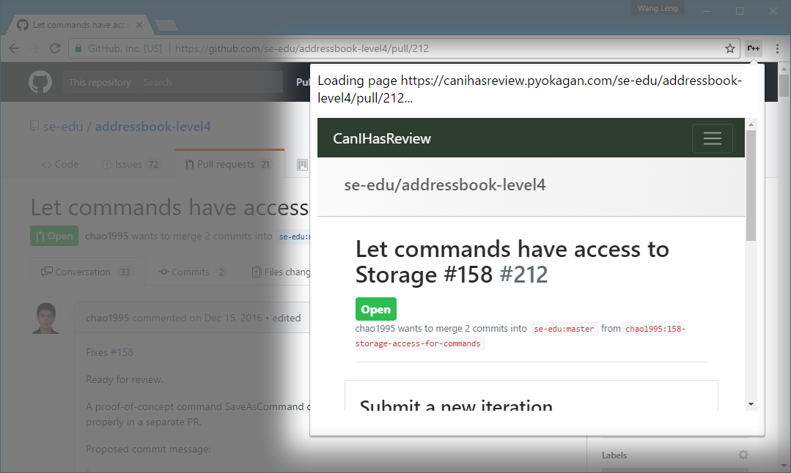

# One More Iteration

Get the corresponding CanIHasReview page for your PR with just a click of the button! Only supports Chrome at the moment.

## Prerequisites

This extension is only supported in Chrome.

## Installation Instructions

You will have to deploy this extension in Developer Mode (I have not packaged the extension yet).

1. Clone this repo to any suitable location on your computer.
1. Open Chrome, and navigate to `chrome://extensions`.
1. Check the `Developer mode` checkbox.
1. Click `Load unpacked extension...`
1. Navigate to the repo directory, and select the `chrome_extension` folder.
1. Enjoy your new shiny extension located at the top right corner of the window (look for the `r++` icon).

## Using the Extension

1. Navigate your browser to your desired PR page.
1. Select the `r++` icon at the top right corner of your window.
1. You may now use 'CanIHasReview', like you have always been, inside the popup.
